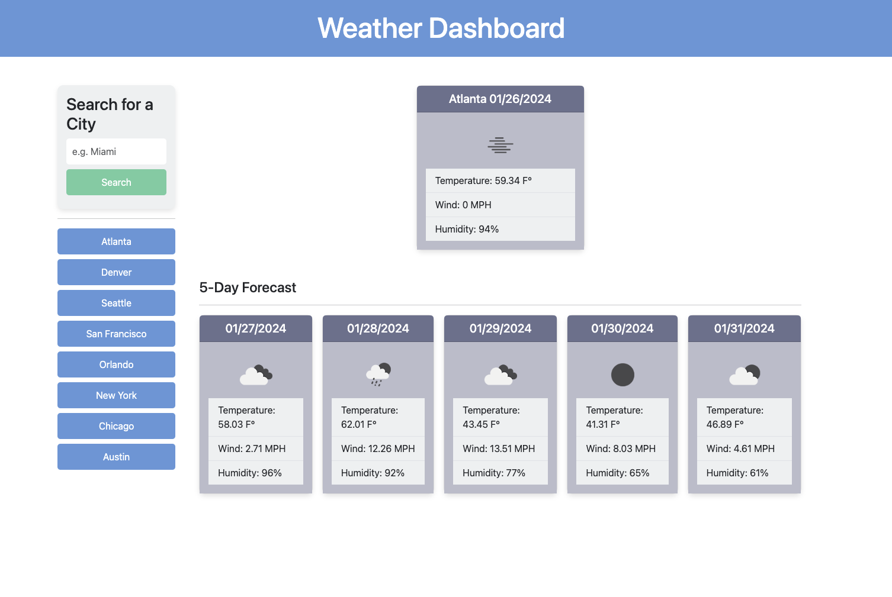

# Weather Dashboard Readme

## Table of Contents
- [Overview](#overview)
- [Features](#features)
- [Usage](#usage)
- [Installation](#installation)
- [Dependencies](#dependencies)
- [Contributing](#contributing)
- [License](#license)
- [Screenshot](#screenshot)

## Overview
The Weather Dashboard is a web application that provides users with current weather information and a five-day forecast for a specified city. Leveraging the OpenWeatherMap API, the dashboard dynamically updates weather data in real-time.

## Features
- **City Search**: Users can input a city name in the search bar and click the "Search" button to fetch and display weather information.
- **Current Weather Card**: Presents current weather details for the searched city, including temperature, wind speed, and humidity.
- **Five-Day Forecast**: Displays a forecast for the next five days, with additional details such as temperature, wind speed, and humidity.
- **City History Buttons**: Previous search results are stored as buttons, enabling users to quickly revisit weather information for previously searched cities.
- **Responsive Design**: The application is designed to provide a seamless user experience across various screen sizes.

## Usage
1. Enter the name of a city in the search input field.
2. Click the "Search" button to initiate the retrieval and display of current weather and five-day forecast data.
3. The current weather card and the five-day forecast cards will be updated with the latest weather information.
4. Easily access weather data for previously searched cities by clicking on the corresponding city buttons.

## Installation
1. Clone the repository to your local machine.
   ```bash
   git clone https://github.com/andersonasprilla/weather-dashboard.git

Open the project folder in a code editor.
Open the index.html file in a web browser.

## Dependencies
- **Bootstrap**: Used for styling and layout.
- **jQuery**: JavaScript library for DOM manipulation.
- **Day.js**: Library for handling dates and times.

## Contributing
Contributions to the Weather Dashboard are encouraged. If you encounter any issues or have suggestions for improvements, please open an issue or submit a pull request.

## License
This project is licensed under the MIT License. You are free to use, modify, and distribute the code in accordance with the terms specified in the license.


- Feel free to modify or extend this template according to your specific needs.

## Screenshot

